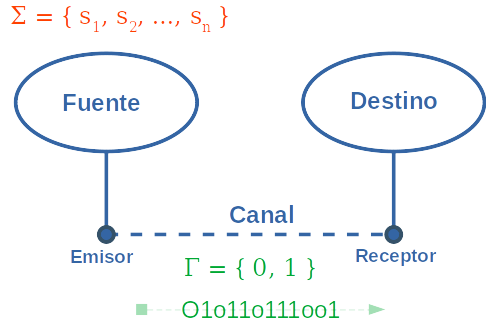

## Teoría de la información

¿Qué es información?


## Comunicación



Para transmitir en el canal digital necesitamos convertir los símbolos que queremos transmitir en símbolos de ese canal.


|$ \Sigma $|$ \Gamma $|
|:----------:|:----------:|
|h | 010 |
|o | 110 |
|l | 111 |
|a | 001 |


## Fuente de Markov

Una fuente se dice **Fuente de Markov de órden n** si la probabilidad de emitir un símbolo depende únicamente de cuales fueron los n símbolos emitidos anteriormente.


## Ejemplos 

Una fuente que envía el resultado de tirar un dado no cargado es una Fuente de Markov de órden 0.

Una estación meteorológica que devuelve el promedio de temperatura a cada hora tomando en cuenta las últimas 6 mediciones es una fuente de Markov de órden 5. <!-- .element: class="fragment" --> 

Una fuente que transmite la serie de Fibonacci, ¿de qué órden es? <!-- .element: class="fragment" --> 


## Codificación de mensajes

**Def**. Si $ \Sigma = \{ s_1, s_2, ..., s_n \} $ es un conjunto de símbolos y $ \Gamma = \{ 0, 1 \} $ es el alfabeto del canal donde se transfiere el mensaje. Decimos código a la secuencia de n palabras

$ w_1, ..., w_n \in \{ 0, 1 \}^* $


**Def**. Un código es unívocamente decodificable si una palabra $ w \in \{ 0, 1 \}^* $ se puede descomponer en a lo sumo de una manera como concatenación de palabras del canal.


Éste código no es unívocamente decodificable:

|$ \Sigma $|$ \Gamma $|
|:----------:|:----------:|
| A | 01 |
| B | 11 |
| C | 1 |

Ya que la palabra 111 puede descomponerse como las secuencias [1, 1, 1], [11, 1] y [1, 11].


**Def**. Un código es libre de prefijos si no hay dos palabras del código $ w_1, w_2 \in \{ 0, 1 \}^* $ tales que $ w_1 $ es prefijo de $ w_2 $.

|$ \Sigma $|$ \Gamma $|
|:----------:|:----------:|
| A | 001 |
| B | 00 |

En el ejemplo anterior codigo(B)=00 era prefijo de codigo(A) = 001, por lo cuál no es libre de prefijo. Pero sí es unívocamente decodificable.


|$ \Sigma $|$ \Gamma $|
|:----------:|:----------:|
| A | 0 |
| B | 10 |
| C | 111 |
| D | 110 |

Es libre de prefijos.

Estos códigos se pueden pensar como árboles binarios dodne nos quedamos con los nodos hoja.

**Observación**. Si un código es libre de prefijos, es unívocamente decodificable.


## Desigualdad de Kraft

**Teorema**. Sean $ \{ l_1, l_2, ..., l_n \} $ número enteros no negativos.

Son equivalentes:

1) Existe un código $ \{ w_1, w_2, ..., w_n \} \subset \{ 0, 1 \}^* $ libre de prefijos y tal que $ |{w_i}| = l_i $

2) $ \sum_{i=0}^n 2^{-l_i} \leq 1 $


### Ejemplos 

$ \\{ 1, 2, 3, 3 \\} $, la suma es $ 1/2 + 1/4 + 1/8 + 1/8 = 1 \leq 1 $. El teorema nos garantia que existe un código libre de prefijos que tiene dichas longitudes.

$ \\{ 2, 1, 2, 2 \\} $, la suma es $ 1/4 + 1/2 + 1/4 + 1/4 = 5/4 > 1 $. Con esta codificación es imposible tener un código libre de prefijos.

$ \\{ 1, 1, 1, 1 \\} $, la suma es 2. Pero podemos ver que también es imposible codificar 4 palabras con un bit cada una.


## Información

Información $ \iff $ Probabilidad

Menor es la probabilidad de un evento, más "Información" es saber que ocurrió.

Pensemos como pagan los juegos de azar.


Sea A un evento.

$ I(A) = - log_2 (P(A)) $

Recordemos que

$ 0 \leq P(A) \leq 1 $

Mientras más infrecuente es el evento, el módulo de la función logaritmo es más alto, por lo que describe el comportamiento necesario.

Como trabajamos con bits, usamos el logaritmo en base 2.


**Observaciones**

- Si un evento tiene probabilidad P(A) = 1/2, la I(A) = -log(1/2) = 1 bit.  
- Si un evento tiene probabilidad P(A) = 1/8, la I(A) = -log(1/8) = 3 bit.  


- Si tenemos dos eventos A, B, independientes, si se dieron los dos eventos:

$ I(A \cap B) = -log_2(P(A \cap B)) $  

$ = -log_2(P(A) * P(B)) $  

$ = -(log_2(P(A))  + log_2(P(B))) $

$ = -(log_2(P(A))) + -(log_2(P(B))) $  

$ = I(A) + I(B) $


## Entropía

**Def**. Una **fuente de memoria nula** es una fuente de Markov de órden 0.

**Def**. Dada una fuente de memoria nula que emite símbolos en un alfabeto $ \Sigma = \{ s_1, s_2, .., s_n \} $, con probabilidades $ p_1, p_2, ..., p_n $

$ H = \sum_{i=1}^n {p_i*I(s_i)} = - \sum_{i=1}^n {p_i*log(p_i)} $


**Ejemplos**.

Fuente A 1/2, B 1/2 

Fuente A 1, B, 0 <!-- .element: class="fragment" --> 

AAAA...A <!-- .element: class="fragment" --> 

Fuente A p, B 1-p <!-- .element: class="fragment" --> 


En general una fuente de n-símbolos alcanza la mayor entropía posible cuando son equiprobables.


## Primer teorema de Shannon.

Está relacionado con la codificación sin pérdida de información.


Dada una fuente de memoria nula con entropía H (bits / símbolo) y dado un canal con capacidad C (bits que se pueden transmitir por segundo).

(1) Es posible transmitir la información a una tasa de transferencia $ C / H - \epsilon $, para valores de $ \epsilon $ arbitrariamente chicos. <!-- .element: class="fragment" --> 

(2) No es posible transmitir a una tasa de transferencia superior a C / H símbolos por segundo. <!-- .element: class="fragment" --> 


## Codificación de Huffman

$ A \rightarrow 01 $  
$ B \rightarrow 001 $  
$ C \rightarrow 10 $  
$ D \rightarrow 111 $  


**Entrada** / 

Un conjunto de símbolos $ \{ s_1, s_2, .., s_n \} $ cada uno con un peso $ p_1, p_2, .., p_n $. El peso puede ser probabilidad, costo de transferencia, tamaño en bits, etc.

**Salida** /
- Una codificación, es decir, para cada símbolo $ s_i $ una palabra $ w_i \in \{ 0, 1 \}^* $.  
- La codificación es libre de prefijos.  
- Minimiza la longitud ponderada, es decir:

$ \sum_{i=1}^n {p_i*|{w_i}|}\ es\ mínima $


**Algoritmo**.

- En cada paso vamos a tener un conjunto de árboles binarios, cada uno con su peso.
- Empezamos con el conjunto:

$ \\{ (s_1, p_1), (s_2, p_2), .., (s_n, p_n) \\} $

- Mientras haya dos o más árboles en el conjunto, sacamos dos árboles con sus pesos, por (x, q), (y,q) del conjunto, los de peso mínimo. Con (x, q), (y, q) armamos un árbol nuevo ( {(r->x, r->y)}, p+q).  


- El proceso termina cuando nos queda un árbol binario único que en las hojas tiene símbolos $ s_i $.

Cada código $ s_i $ está dado por el camino desde la raíz hasta la hoja correspondiente.


Ejemplo:

Tengo el mensaje CABABADCADED. 12 bytes ASCII. 

$ A \rightarrow 4 $  
$ B \rightarrow 2 $  
$ C \rightarrow 2 $  
$ D \rightarrow 3 $  
$ E \rightarrow 1 $  


$ \\{ (A, 4), (B, 2), (C, 2), (D, 3), (E, 1) \\} $

Tomo la C y la E y construyo un arbolito.  <!-- .element: class="fragment" -->

El peso del árbol nuevo es 2+1 = 3.  <!-- .element: class="fragment" -->

$ \\{ (A, 4), (B, 2), $
$ ([o \rightarrow C, o \rightarrow E], 3), (D, 3) \\} $  <!-- .element: class="fragment" -->


Tomamos ahora la D y la B, los de menor peso. Podríamos haber tomado el arbol nuevo y la B, pero nos hubieran quedado más niveles.

$ \\{ (A, 4), ([o \rightarrow C, o \rightarrow E], 3), $
$ ([p \rightarrow B, p \rightarrow D], 5) \\} $  <!-- .element: class="fragment" -->


$ (A,4) $ y $ ([o \rightarrow C, o \rightarrow E]) $ son los árboles con menos peso, por lo que construyo uno nuevo con peso 7:

$ \\{ ([q \rightarrow A, q \rightarrow o, o \rightarrow C, o \rightarrow E], 7), $
$ ([p \rightarrow B, p \rightarrow D], 5) \\} $  <!-- .element: class="fragment" -->

Observemos que unimos el arbol compuesto sólo por A con el que tiene raíz o. <!-- .element: class="fragment" -->


Ahora solo nos quedan dos árboles, uno de peso 7 y otro de peso 5, los unimos con un nodo raíz r.

$ \\{ ([r \rightarrow q, r \rightarrow  p, q \rightarrow A, q \rightarrow o, o \rightarrow C, o \rightarrow E, $
$ p \rightarrow B, p \rightarrow D], 12) \\} $ <!-- .element: class="fragment" -->


$ 00 \rightarrow A $ 
$ 010 \rightarrow E $
$ 011 \rightarrow C $
$ 110 \rightarrow B $
$ 111 \rightarrow D $


El mensaje codificado

```
C  A B  A B  A D  C  A D  E  D    -> 12 bytes 
01100110001100011101100111010111  -> 32 bits -> 4 bytes
```