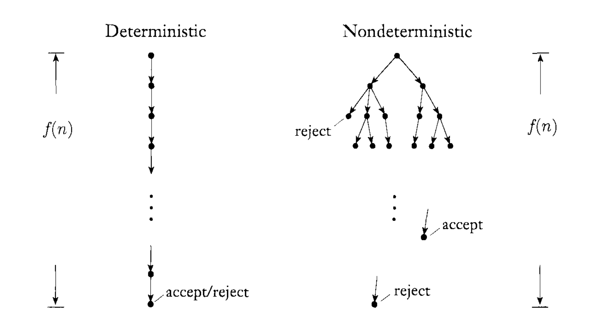
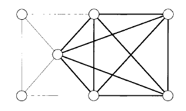
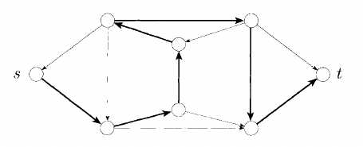
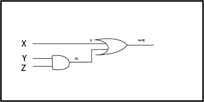
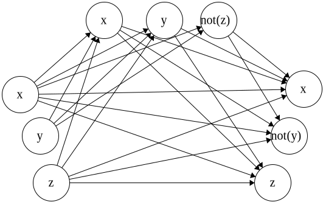

### Clases de complejidad temporal


**Def**: Sea $ t: N \rightarrow R^+ $ una función. Definimos la clase de complejidad temporal, $ TIME(t(n)) $, a la colección de todos los lenguajes que son decidibles por una máquina de Turing dominada por $ O(t(n)) $.


*Ejemplo*. Sea un MT que decide el lenguaje $ A = \\{ 0^k1^k | k \geq 0 \\} $. $ A \in TIME(n^2) $ ya que se puede construir una máquina de Turing M que decide el lenguaje en A en tiempo $ O(n^2) $.


**Teorema**. Sea $ t(n) $ una función donde $ t(n) \geq n $. Luego toda máquina de Turing multi-cinta tiene una máquina de Turing equivalente de órden $ O(t^2(n)) $ de una sola cinta.

**Idea**. Recordemos que podíamos simular una MT multi-cinta en una máquina de una sóla cinta. Para eso concatenabamos el contenido de todas las cintas en una sola cinta. 


Supongamos que tenemos una máquina M multi-cinta y una máquina S de una sóla cinta. Para simular cada paso de M, S debe ubicarse en la posición de un carácter y probablemente moverse a derecha para leer la posición de la región de la otra cinta. Para esto S debe moverse a derecha a lo sumo n posiciones.


Esta situación se repite por cada paso, resulta que apróximada por los n pasos de M necesitamos movernnos nxn en S. Con lo cuál si M era dominada por $ O(t(n)) $, S será dominada por $ t(n)*O(n) = O(t^2(n)) $


**Def** Sea $ \mathcal{N} $ una MT no Determinística que decide un lenguaje. El tiempo de ejecución de $ \mathcal{N} $ es la función de $ \mathbb{N} \rightarrow \mathbb{N} $ donde $ f(n) $ es el máximo número de pasos que usa $ \mathcal{N} $ en cualquier rama de cualquier entrada de longitud n, como se muestra en el siguiente gráfico.


.


Cosas interesantes para recordar: 

- si por algún camino llegamos a un estado de aceptación, la MT acepta.
- para probar que rechaza hay que recorrer todos los caminos y llegar a un estado de rechazo.
- por suerte estamos en el caso de MTs que deciden. Es decir siempre terminan.


**Teorema**.  Sea $ t(n) $ una función donde $ t(n) \geq n $. Luego toda máquina de Turing no determinística tiene una máquina de Turing determinística equivalente de orden $ 2^{O(t(n))} $.


Vamos a recorrer el camino de mayor complejidad a menor. Normalmente, se va de menor a mayor.

¿Por qué lo vemos así? Porque es más parecido a como programamos.


Pero antes, los problemas más comunes:

|Inglés|Castellano|
|:----:|:--------:|
|RELPRIMES|Coprimos|
|COMPOSITE|No primo|
|PRIME|Es primo?|
|HAMPATH|Camino Hamiltoniano|
|TSP|Problema del viajero|
|SAT|Fórmula $ \phi(x1,..,xn) = true $|


#### Clase EXPTIME

Fuerza bruta. En esta clase los problemas están dominados por una t(n) de $ O(2^{t(n)}) $.

Generamos todas las posibles combinaciones para una entrada w de longitud n y nos quedamos con la solución que resuelva nuestro problema. Verificar estas soluciones nos puede tomar tiempo exponencial.


$ EXPTIME = \bigcup\limits_{ k \in \mathbb{N} } \\{ TIME(2^{n^k}) \\} $


**Ejemplos**

- Go, Damas y Ajedrez Generalizados
- HALT en a lo sumo k-pasos. Recordar que HALT no es decidible.
- Todos los problemas que vamos a ver hoy como RELPRIME, HAMPATH, COMPOSITES


#### Clase NP

Existen problemas donde podemos verificar que la solución en un tiempo polinomial.

Es decir, obtenemos una solución generada por fuerza bruta. Si podemos verificar que esta solución es buena en tiempo polinómico estamos en la clase NP.


**def**. Un verificador para un lenguaje $ A $ es un algoritmo $ V $ donde:

$ A = \\{ w | \text{V acepta <w,c> para alguna cadena c} \\}. $

Medimos el tiempo de un verificador sólo en términos de la longitud de w, por lo que que un **verificador de tiempo polinómico** corre en tiempo polinómica en la longitud de w. Se dice que $ A $ es **verificable polinómicamente** si existe un verificador polinómico. 


**def**. $ NP $ es la clase de los lenguajes que tienen un verificador polinómico.

**teorema**. Un lenguaje pertenece a NP sí y sólo sí es decidido por alguna Máquina de Turing No Determinística.

**idea**. Convertimos el verificador que existe por ser NP en su MT No Determinística equivalente y vice versa. La MTND simula el verificador adivinando el certificado. El verificador simula la MTND usando la rama que llega a estado de aceptación como certificado.


**def**. $ NTIME(t(n)) = \\{ \text{L es un lenguaje } $
$ \text{decidido por por una MT No Determinística} $
$ \text{de órden }O(t(n)) \\} $

**corolario**. $ NP = \bigcup\limits_{ k \in \mathbb{N} } \\{ NTIME(n^k) \\} $


**Ejemplo**. Un CLIQUE en un grafo es un subgrafo donde cada nodo está conectado con los demás nodos del subgrafo. Un k-clique es un clique que contiene k nodos.



**dem**. Se construye el verificador. Si probamos que es polinómico CLIQUE está en NP.


**dem**. El siguiente es un Verificador para CLIQUE:

```
V = "Para una entrada <<G, k>, c>:
  1. Verificar si c es un set de k-nodos en G. (n^2)
  2. Verificar si G contiene todos los ejes que
     conectan a los nodos de c. Para cada n en c,
     c-1 verificaciones ~ n*(n-1)
  3. Si pasa ambos, acepta el verificador, sino rechaza.
```

La complejidad es n^2 + n^2 - n = 2n^2 - n dominada por $ O(n^2) $. Es tiempo polinómico.


**Ejemplo**. HAMPATH. Un Camino de Hamilton es un camino en un grafo dirigido que pasa éxactamente una vez por cada nodo. Consideramos el problema de verificar si un grafo contiene un Camino Hamiltoniano conectando dos nodos específicos.


**def**. Sea $ HAMPATH = \\{ <G,s,t> | \text{ G es un digrafo con } $
$ \text{un Camino de Hamilton de s a t } \\} $




**dem**. Para construir el verificador buscamos todos los caminos que van desde s. Si detectamos un ciclo lo descartamos. Nos quedamos con los que terminen en t. 


**Ejemplo**. RELPRIME. Dados dos números x e y, son coprimos. Enumeramos todos los números primos que dividen a x y todos los que dividen a y. Verificamos que la intersección entre los dos conjuntos sea vacío. Para cada n en FACTORES(x) verificamos que no exista en FACTORES(y). Si |FACTORES(x)| = k y |FACTORES(y)| = l, la complejidad es $ k * l \leq max\\{k,l\\}^2 \leq n^2 $ 


#### Clase P

Para algunos problemas existen algoritmos que permiten encontrar una solución en tiempo Polinomial con una MT Determinística.


**def**. Decimos P a la clase de lenguajes decidibles en tiempo polinomial por una MT Determinística de una sóla cinta.

$ P = \bigcup\limits_{ k \in \mathbb{N} } \\{ TIME(n^k) \\} $


Esta clase juega un rol central en nuestra teoría y es importante porque:

1. P es invariante para todos los modelos de computación.
2. P corresponde a grosso modo a los problemas que se pueden resolver realistamente en una computadora.


**Ejemplo**. Dado un grafo, queremos saber si hay un camino del nodo s al nodo t.

$ PATH = \\{ <G,s,t> |\text{ G es un digrafo }$
$ \text{que tiene un camino dirigido de s a t. }\\}$


**dem**. Construimos un algoritmo de tiempo polinómico.


**Ejemplo**. Coprimos.

$ RELPRIME = \\{ <x,y> |\text{ x e y son co-primos }\\}$

Anteriormente vimos que por fuerza bruta podemos generar soluciones y con un Verificador polinómicos podemos resolverlo.

Sin embargo hay un algoritmo de tiempo polinómico desarrollado por Euclides para obtener el máximo común divisor.


El algoritmo de Euclides. Este es un algoritmo recursivo que dados x e y, si gcd(x,y) = 1 entonces son coprimos.

```
E = "Para <x,y>, donde x e y son números enteros en binario: 
  1. Repetir hasta que y = 0:
  2.   Asignar x <- x mod y
  3.   Intercambiar x e y.
  4. Retornar x."

R = "Para <x,y>, donde x e y son números enteros en binario: 
  1. Correr E con <x,y>.
  2. Si el resultado es 1, aceptar, sino rechazar."
```


**Ejemplo**. Todo lenguaje independiente del contexto es decidible en tiempo polinomial P.

Esto significa que compilar es chévere!


### Problemas NP-Completo

Cooke & Levin probaron en los '70 que la complejidad de ciertos problemas indivuales está relacionada con la complejidad de la clase completa. 

Si se hallara una solución de tiempo Polinomial para estos problemas podrían resolverse todos los problemas de la clase en tiempo polinómico.

Estos problemas se llaman **NP-Completo**.


Si podemos reducir many-to-one nuestro problema a uno de estos problemas NP-Completo, sabemos que nuestro problema está en la clase NP y tal vez no valga la pena buscar una solución polinómica determinística.


Son problemas de **decisión**:

- existe un camino hamiltoniano en el grafo G?
- existe un k-clique en el grafo G'?
- existe una combinación de variables booleanas que satisfagan una fórmula $ \phi $.

Deben responder Sí o No, true o false, 0 o 1.


Son problemas de **optimización**. Ej: 

- El camino hamiltonianos dentro del grafo G
- El subgrafo k-clique del grafo G'
- Una combinación de variables booleanas que satisfagan la fórmula $ \phi $.

Entre todas las respuestas factibles se debe responder la que maximiza o minimiza un objetivo dado.


**def** L es NP-Completo si 

**def**. B es NP-Completo si cumple estas dos condiciones:

1. B  $ \in $ NP y...
2. A $  \leq_{P} $ A para algún problema NP-completo conocido.


#### Genealogía de Problemas NP-Completos

SUBSET COVER $ \leq_{P} $ VERTEX COVER $ \leq_{P} $ CLIQUE $ \leq_{P} $ 3-SAT $ \leq_{P} $ SAT $ \leq_{P} $ CIRCUIT SAT $ \leq_{P} $ NP


##### CIRCUIT SAT

Dado un diagrama queremos verificar la salida de una entrada en tiempo P.




#### SAT

Lo transformo en SAT escribiendo la expresión booleana:

F = X + YZ


#### 3-SAT

O forma normal conjuntiva - 3 CNF

Reescribimos el circuito con una conjunción de términos disyuntivos...

Un AND grande de ORs con todas las variables y sus posibles valores.
<!-- .element: class="fragment" -->

Usando álgebra de Boole y Leyes de De Morgan...
<!-- .element: class="fragment" -->


$ F = X + YZ $

$   = (X+Y).(X+Z) $ 
<!-- .element: class="fragment" -->

$   = (X+Y+Z\overline{Z}) (X+Y\overline{Y}+Z) $
<!-- .element: class="fragment" -->

$   = (X+Y+Z) (X+Y+\overline{Z}) (X+Y+Z) (X+\overline{Y}+Z) $
<!-- .element: class="fragment" -->

$   = (X+Y+Z) (X+Y+\overline{Z}) (X+\overline{Y}+Z) $
<!-- .element: class="fragment" -->


### k-Clique

Podemos reducir 3-SAT a k-Clique

A partir de la expresión generamos un digrafo:

1. Cada variable es un vértice y las agrupamos por clausula.
2. Conectamos los vértices con vértices de otra clausulas que no se contradigan. Ej: X conecta a Y, pero Y no a $ \overline{Y} $.

Si el grafo tiene un k-clique, entonces hay una combinación de X, Y y Z que satisfaga la fórmula.


$ (X+Y+Z) (X+Y+\overline{Z}) (X+\overline{Y}+Z) $


<!-- .element: class="fragment" -->


|Clase|Condición|Tipo|
|:---:|:-------:|:--:|
|P    |Existe MTD que decide en $ O(n^k) $ |Decisión|
|NP   |Existe MTN que decide en $ O(n^k) $ |Decisión|
|NP-Complete|En NP y reducible a otro NP-Completo |Decisión|
|NP-Hard|Reducible a NP-Completo, no al reves|Optimización|


#### Problemas NP-Hard

No satisfacen la primer condición de los NP-Complete.


#### Conjeturando...


#### ¿Qué hacer?

Si nos topamos con un problema en estas clases de complejidad:

- Heurísticas. Proponen solución rápida no precisa y se acerca.
- Algoritmos de aproximación. Basados en modelos, aproximan una solución con ciertas cotas o límites.
- Algoritmos paramétricos. Reducciones del problema con algún parámetro.
- IA, Machine Learning & et al.
